# 🚀 Sachin Maurya - Frontend Developer Portfolio

<div align="center">

```
╔════════════════════════════════════════════════════════════════════════════════╗
║                                                                                ║
║   ███████╗ █████╗  ██████╗██╗  ██╗██╗███╗   ██╗                                ║
║   ██╔════╝██╔══██╗██╔════╝██║  ██║██║████╗  ██║                                ║
║   ███████╗███████║██║     ███████║██║██╔██╗ ██║                                ║
║   ╚════██║██╔══██║██║     ██╔══██║██║██║╚██╗██║                                ║
║   ███████║██║  ██║╚██████╗██║  ██║██║██║ ╚████║                                ║
║   ╚══════╝╚═╝  ╚═╝ ╚═════╝╚═╝  ╚═╝╚═╝╚═╝  ╚═══╝                                ║
║                                                                                ║
║                    Frontend Developer | React.js Specialist                    ║
║                       Performance Optimization Expert                          ║
║                                                                                ║
╚════════════════════════════════════════════════════════════════════════════════╝
```

[](https://maurya-sachin.vercel.app)
[](https://linkedin.com/in/maurya-sachin)
[](https://maurya-sachin.vercel.app/api/download-resume)
[](mailto:sachinmaurya1710@gmail.com)
[](https://github.com/maurya-sachin)

</div>

<div align="center">
  
</div>

---

## 👨‍💻 About Me

I'm a **Frontend Developer** specializing in building exceptional digital experiences with **React.js, Next.js, and TypeScript**. With **2+ years** of hands-on experience in the industry, I focus on creating high-performance, accessible, and scalable web applications that deliver measurable business results.

<div align="center">

### 💭 Developer Philosophy

_"Optimizing user experience through clean code, performance excellence, and innovative solutions."_

### 🎯 Current Focus & Expertise

```typescript
const sachinMaurya = {
  role: "Frontend Developer",
  company: "Kreate Technologies",
  experience: "2+ years",

  expertise: {
    frameworks: ["React.js", "Next.js", "TypeScript"],
    specializations: [
      "Performance Optimization (80% improvements)",
      "Component Architecture",
      "API Integration (REST, GraphQL)",
      "Accessibility (WCAG 2.1 AA)",
      "SEO Optimization",
    ],
  },

  currentGoals: {
    learning: "Advanced React Patterns & Micro-frontends",
    building: "Scalable Component Libraries",
    optimizing: "Core Web Vitals & Performance",
    exploring: "AI-powered Development Tools",
  },

  achievements: {
    performanceImprovements: "80% faster load times",
    lighthouseScores: "95+ consistently",
    apiOptimization: "20% latency reduction",
    developmentEfficiency: "30% faster cycles",
  },
};
```

</div>

🎯 **Currently seeking**: Frontend Developer / React Developer opportunities  
📍 **Location**: Delhi, India (Open to remote & hybrid work)  
🌟 **Specialization**: Performance optimization, modern React patterns, and enterprise-grade solutions

### 🏆 Key Professional Achievements

<div align="center">

| 🎯 **Metric**         | 📊 **Achievement**          | 🚀 **Impact**                          |
| --------------------- | --------------------------- | -------------------------------------- |
| ⚡ **Performance**    | 80% faster load times       | Enhanced user experience & SEO         |
| 🎯 **Quality Score**  | 95+ Lighthouse consistently | Industry-leading performance standards |
| 📦 **Development**    | 30% faster delivery cycles  | Improved team productivity             |
| 🔗 **API Efficiency** | 20% latency reduction       | Better app responsiveness              |
| ♿ **Accessibility**  | WCAG 2.1 AA compliance      | Inclusive user experience              |
| 📱 **Mobile Score**   | 96+ mobile performance      | Excellent mobile experience            |

</div>

---

## 🛠️ Professional Tech Stack

<div align="center">

### Core Technologies

<table>
  <tr>
    <td align="center" width="100">
      
      <br><strong>React.js</strong>
    </td>
    <td align="center" width="100">
      
      <br><strong>JavaScript</strong>
    </td>
    <td align="center" width="100">
      
      <br><strong>TypeScript</strong>
    </td>
    <td align="center" width="100">
      
      <br><strong>GitHub</strong>
    </td>
    <td align="center" width="100">
      
      <br><strong>Prettier</strong>
    </td>
  </tr>
</table>

</div>

### 🎨 Frontend Development


### 🎭 Styling & Animation


### 🔄 State Management & APIs


### 🛠️ Development Tools & Deployment


### 🧪 Testing & Quality


---

## 🎨 Featured Projects Portfolio

### 🤖 [GENAI Document Analyzer](https://github.com/maurya-sachin/genai-analyzer)

> **Enterprise AI-powered document processing platform**

**🔧 Tech Stack:** `React.js` `Redux Toolkit` `TypeScript` `Python API` `WebSockets`

**🎯 Key Features & Achievements:**

- 🤖 **Real-time AI chat functionality** with document context awareness
- 🔒 **Secure document vault system** with user authentication & authorization
- 📊 **Advanced analytics dashboard** with real-time data visualization
- ⚡ **Performance optimized** with 98% accuracy and 90+ Lighthouse score
- 👥 **Multi-user collaboration** with role-based access control

**📊 Business Impact:**

- 🎯 **500+ active users** with consistent growth
- 📈 **98% processing accuracy** for document analysis
- ⚡ **90+ performance score** maintaining excellence
- 🔄 **Real-time processing** with sub-second response times

<details>
<summary>💡 Technical Implementation Highlights</summary>

```typescript
// Advanced State Management with Redux Toolkit
const documentSlice = createSlice({
  name: 'documents',
  initialState: {
    documents: [],
    activeDocument: null,
    processingStatus: 'idle',
    chatHistory: [],
  },
  reducers: {
    setActiveDocument: (state, action) => {
      state.activeDocument = action.payload;
      state.chatHistory = [];
    },
    addChatMessage: (state, action) => {
      state.chatHistory.push({
        id: generateId(),
        ...action.payload,
        timestamp: Date.now(),
      });
    },
  },
});

// Custom Hook for WebSocket Integration
const useDocumentWebSocket = (documentId: string) => {
  const [socket, setSocket] = useState<WebSocket | null>(null);
  const [connectionStatus, setConnectionStatus] = useState<'connecting' | 'connected' | 'disconnected'>('disconnected');

  useEffect(() => {
    if (!documentId) return;

    const ws = new WebSocket(`${WS_BASE_URL}/documents/${documentId}`);

    ws.onopen = () => {
      setConnectionStatus('connected');
      setSocket(ws);
    };

    ws.onmessage = (event) => {
      const data = JSON.parse(event.data);
      // Handle real-time updates
    };

    return () => {
      ws.close();
      setConnectionStatus('disconnected');
    };
  }, [documentId]);

  return { socket, connectionStatus };
};

// Performance-optimized Document Renderer
const DocumentRenderer = React.memo(({ document, viewport }) => {
  const virtualizedItems = useMemo(() =>
    document.pages.slice(
      viewport.startIndex,
      viewport.endIndex + BUFFER_SIZE
    ), [document.pages, viewport]
  );

  return (
    <VirtualizedList
      items={virtualizedItems}
      itemHeight={ITEM_HEIGHT}
      renderItem={({ item, index }) => (
        <DocumentPage
          key={`page-${item.id}`}
          page={item}
          onAnnotationAdd={handleAnnotationAdd}
        />
      )}
    />
  );
});
```

</details>

---

### 🌐 [Kreate Technologies Corporate Website](https://github.com/maurya-sachin/kreate-website)

> **High-performance corporate website with advanced animations**

**🔧 Tech Stack:** `Next.js 14` `GSAP` `Tailwind CSS` `TypeScript` `React Query`

**🎯 Key Features & Achievements:**

- 🎨 **Advanced GSAP animations** with smooth micro-interactions
- 🚀 **SEO optimization** achieving 95+ Lighthouse score across all metrics
- 📱 **Mobile-first responsive design** with 96+ mobile performance score
- ⚡ **Performance excellence** with 0.8s load time consistently
- 🌙 **Dark/Light theme system** with user preference persistence

**📊 Business Impact:**

- ⚡ **0.8s average load time** (industry benchmark: 3s)
- 📈 **+45% conversion rate improvement** post-optimization
- 🎯 **95+ Lighthouse score** across Performance, SEO, Accessibility
- 📱 **96+ mobile score** ensuring excellent mobile UX

<details>
<summary>🎨 Animation & Performance Code Highlights</summary>

```typescript
// Advanced GSAP Animation System
class AnimationController {
  private timeline: gsap.core.Timeline;
  private scrollTriggers: ScrollTrigger[] = [];

  constructor() {
    this.timeline = gsap.timeline();
    this.initScrollAnimations();
  }

  initScrollAnimations() {
    // Hero section reveal animation
    const heroTl = gsap.timeline();
    heroTl
      .from('.hero-title', {
        y: 100,
        opacity: 0,
        duration: 1.2,
        ease: 'power3.out'
      })
      .from('.hero-subtitle', {
        y: 50,
        opacity: 0,
        duration: 0.8,
        ease: 'power2.out'
      }, '-=0.6')
      .from('.hero-cta', {
        scale: 0.8,
        opacity: 0,
        duration: 0.6,
        ease: 'back.out(1.7)'
      }, '-=0.4');

    // Scroll-triggered section animations
    gsap.utils.toArray('.fade-in-section').forEach((section: any) => {
      gsap.fromTo(section,
        { y: 60, opacity: 0 },
        {
          y: 0,
          opacity: 1,
          duration: 1,
          ease: 'power2.out',
          scrollTrigger: {
            trigger: section,
            start: 'top 80%',
            end: 'bottom 20%',
            toggleActions: 'play none none reverse'
          }
        }
      );
    });
  }

  cleanup() {
    this.scrollTriggers.forEach(trigger => trigger.kill());
    this.timeline.kill();
  }
}

// Performance-optimized Image Component
const OptimizedImage = ({
  src,
  alt,
  className,
  priority = false,
  ...props
}) => {
  const [isLoaded, setIsLoaded] = useState(false);

  return (
    <div className={`relative overflow-hidden ${className}`}>
      <Image
        src={src}
        alt={alt}
        fill
        priority={priority}
        quality={90}
        onLoadingComplete={() => setIsLoaded(true)}
        className={`transition-opacity duration-500 ${
          isLoaded ? 'opacity-100' : 'opacity-0'
        }`}
        sizes="(max-width: 768px) 100vw, (max-width: 1200px) 50vw, 33vw"
        {...props}
      />
      {!isLoaded && (
        <div className="absolute inset-0 bg-gray-200 animate-pulse" />
      )}
    </div>
  );
};

// Advanced Theme System with System Preference Detection
const useAdvancedTheme = () => {
  const [theme, setTheme] = useState<'light' | 'dark' | 'system'>('system');
  const [resolvedTheme, setResolvedTheme] = useState<'light' | 'dark'>('light');

  useEffect(() => {
    const savedTheme = localStorage.getItem('theme') as 'light' | 'dark' | 'system' || 'system';
    setTheme(savedTheme);

    const mediaQuery = window.matchMedia('(prefers-color-scheme: dark)');

    const updateResolvedTheme = () => {
      if (savedTheme === 'system') {
        setResolvedTheme(mediaQuery.matches ? 'dark' : 'light');
      } else {
        setResolvedTheme(savedTheme as 'light' | 'dark');
      }
    };

    updateResolvedTheme();
    mediaQuery.addEventListener('change', updateResolvedTheme);

    return () => mediaQuery.removeEventListener('change', updateResolvedTheme);
  }, []);

  const toggleTheme = useCallback((newTheme: 'light' | 'dark' | 'system') => {
    setTheme(newTheme);
    localStorage.setItem('theme', newTheme);

    if (newTheme === 'system') {
      const prefersDark = window.matchMedia('(prefers-color-scheme: dark)').matches;
      setResolvedTheme(prefersDark ? 'dark' : 'light');
    } else {
      setResolvedTheme(newTheme);
    }

    document.documentElement.classList.toggle('dark', resolvedTheme === 'dark');
  }, [resolvedTheme]);

  return { theme, resolvedTheme, toggleTheme };
};
```

</details>

---

### 📋 [Interactive Kanban Board](https://github.com/maurya-sachin/kanban-board)

> **Modern task management system with real-time collaboration**

**🔧 Tech Stack:** `React.js` `TypeScript` `React DND` `Zustand` `Socket.io`

**🎯 Key Features & Achievements:**

- 🖱️ **Drag & drop functionality** with React DND for intuitive task management
- 🔄 **Real-time collaboration** with Socket.io for multi-user environments
- 🏗️ **Type-safe development** with comprehensive TypeScript implementation
- 📊 **Advanced analytics** with task completion tracking and team insights
- 🎨 **Responsive design** optimized for all device types

**📊 Business Impact:**

- 📝 **2000+ tasks managed** efficiently across platform
- 👥 **25+ active teams** using the platform daily
- 📈 **+40% team efficiency** improvement reported
- ⚡ **Sub-100ms** drag operation response time

<details>
<summary>🚀 Advanced Implementation Details</summary>

```typescript
// Advanced Zustand Store with TypeScript
interface KanbanStore {
  boards: Board[];
  activeBoard: string | null;
  draggedTask: Task | null;

  // Actions
  createBoard: (board: Omit<Board, 'id'>) => void;
  updateBoard: (id: string, updates: Partial<Board>) => void;
  deleteBoard: (id: string) => void;

  // Task actions
  createTask: (boardId: string, columnId: string, task: Omit<Task, 'id'>) => void;
  updateTask: (boardId: string, taskId: string, updates: Partial<Task>) => void;
  moveTask: (boardId: string, taskId: string, fromColumn: string, toColumn: string, position: number) => void;
  deleteTask: (boardId: string, taskId: string) => void;

  // Drag actions
  setDraggedTask: (task: Task | null) => void;
}

const useKanbanStore = create<KanbanStore>((set, get) => ({
  boards: [],
  activeBoard: null,
  draggedTask: null,

  createBoard: (boardData) => {
    const newBoard: Board = {
      ...boardData,
      id: generateId(),
      createdAt: Date.now(),
      updatedAt: Date.now(),
    };

    set((state) => ({
      boards: [...state.boards, newBoard],
      activeBoard: newBoard.id,
    }));
  },

  moveTask: (boardId, taskId, fromColumn, toColumn, position) => {
    set((state) => {
      const boardIndex = state.boards.findIndex(b => b.id === boardId);
      if (boardIndex === -1) return state;

      const board = { ...state.boards[boardIndex] };
      const task = board.columns[fromColumn].tasks.find(t => t.id === taskId);

      if (!task) return state;

      // Remove from source column
      board.columns[fromColumn].tasks = board.columns[fromColumn].tasks.filter(t => t.id !== taskId);

      // Add to destination column at specific position
      board.columns[toColumn].tasks.splice(position, 0, {
        ...task,
        updatedAt: Date.now(),
      });

      const updatedBoards = [...state.boards];
      updatedBoards[boardIndex] = board;

      return { boards: updatedBoards };
    });
  },
}));

// Advanced Drag and Drop Component
const DraggableTask: React.FC<{ task: Task; columnId: string }> = ({ task, columnId }) => {
  const [{ isDragging }, drag, preview] = useDrag({
    type: 'TASK',
    item: {
      id: task.id,
      columnId,
      type: 'TASK'
    },
    collect: (monitor) => ({
      isDragging: monitor.isDragging(),
    }),
  });

  const [{ isOver, canDrop }, drop] = useDrop({
    accept: 'TASK',
    drop: (item: DragItem, monitor) => {
      if (!monitor.isOver({ shallow: true })) return;

      const { moveTask } = useKanbanStore.getState();
      moveTask(
        activeBoardId,
        item.id,
        item.columnId,
        columnId,
        tasks.length
      );
    },
    collect: (monitor) => ({
      isOver: monitor.isOver({ shallow: true }),
      canDrop: monitor.canDrop(),
    }),
  });

  // Custom drag preview
  useEffect(() => {
    preview(getEmptyImage(), { captureDraggingState: true });
  }, [preview]);

  return (
    <div
      ref={(node) => drag(drop(node))}
      className={`
        task-card p-4 bg-white rounded-lg shadow-sm border cursor-move
        transition-all duration-200 hover:shadow-md
        ${isDragging ? 'opacity-50 rotate-2 scale-105' : 'opacity-100'}
        ${isOver && canDrop ? 'border-blue-300 bg-blue-50' : 'border-gray-200'}
      `}
    >
      <div className="task-content">
        <h3 className="font-semibold text-gray-800">{task.title}</h3>
        <p className="text-sm text-gray-600 mt-1">{task.description}</p>

        <div className="flex items-center justify-between mt-3">
          <TaskPriority priority={task.priority} />
          <TaskAssignees assignees={task.assignees} />
        </div>

        <div className="flex items-center justify-between mt-2">
          <TaskLabels labels={task.labels} />
          <span className="text-xs text-gray-500">
            {formatDistanceToNow(task.createdAt)} ago
          </span>
        </div>
      </div>
    </div>
  );
};

// Real-time Socket Integration
const useRealtimeKanban = (boardId: string) => {
  const socket = useSocket();
  const { updateTask, moveTask, createTask, deleteTask } = useKanbanStore();

  useEffect(() => {
    if (!socket || !boardId) return;

    socket.emit('join:board', boardId);

    const handleTaskUpdate = (data: { taskId: string; updates: Partial<Task> }) => {
      updateTask(boardId, data.taskId, data.updates);
    };

    const handleTaskMove = (data: {
      taskId: string;
      fromColumn: string;
      toColumn: string;
      position: number;
    }) => {
      moveTask(boardId, data.taskId, data.fromColumn, data.toColumn, data.position);
    };

    socket.on('task:updated', handleTaskUpdate);
    socket.on('task:moved', handleTaskMove);
    socket.on('task:created', (task: Task) => createTask(boardId, task.columnId, task));
    socket.on('task:deleted', ({ taskId }: { taskId: string }) => deleteTask(boardId, taskId));

    return () => {
      socket.emit('leave:board', boardId);
      socket.off('task:updated', handleTaskUpdate);
      socket.off('task:moved', handleTaskMove);
      socket.off('task:created');
      socket.off('task:deleted');
    };
  }, [socket, boardId]);
};
```

</details>

---

## 💼 Professional Experience

### 🏢 **Frontend Developer** | Kreate Technologies Pvt Ltd

**📅 May 2024 - Present** | Ghaziabad, India

**🚀 Key Achievements & Responsibilities:**

- ⚡ **Performance Leadership**: Optimized Next.js applications achieving **80% faster load times** and **40% TTI improvement**
- 🔗 **API Architecture**: Developed GraphQL middleware reducing API latency by **20%** and improving data fetching efficiency
- 🏆 **Quality Excellence**: Consistently achieved **95+ Lighthouse scores** across Performance, Accessibility, SEO, and Best Practices
- 🏗️ **Component Systems**: Built comprehensive reusable component library reducing development time by **30%**
- 🎯 **Enterprise Solutions**: Led frontend architecture for GENAI Document Analyzer handling **500+ concurrent users**
- 🔄 **Real-time Features**: Implemented WebSocket integrations for live document processing and collaboration

**🛠️ Technical Stack**: React.js, Next.js, TypeScript, GraphQL, Tailwind CSS, Redux Toolkit, Python APIs, WebSockets

---

### 👨‍🎓 **Frontend Development Trainee** | Kreate Technologies Pvt Ltd

**📅 September 2023 - April 2024** | Ghaziabad, India

**🎯 Key Achievements & Learning:**

- ♿ **Accessibility Excellence**: Developed WCAG 2.1 AA compliant government portal interfaces ensuring inclusive design
- 📊 **Scalable Dashboards**: Created responsive data visualization dashboards serving **10,000+ daily active users**
- 🚀 **Framework Advocacy**: Championed Next.js adoption across development teams improving project performance and SEO
- 📱 **Cross-platform Development**: Built mobile-responsive applications ensuring seamless UX across all devices
- 🎨 **Design Implementation**: Collaborated with design teams to implement pixel-perfect interfaces from Figma designs
- 📋 **Code Standards**: Implemented ESLint and Prettier configurations improving code quality and team collaboration

**🛠️ Technical Stack**: HTML5, CSS3, JavaScript, React.js, Next.js, Bootstrap, SCSS, Figma, Git

---

### 💻 **WordPress Developer Intern** | Digidex Labs Pvt Ltd

**📅 April 2023 - August 2023** | Remote

**🎯 Key Projects & Learning:**

- 🌐 **Custom Development**: Built custom WordPress themes and plugins for client websites improving functionality
- ⚡ **Performance Optimization**: Achieved significant performance improvements through code optimization and caching
- 👥 **Client Delivery**: Successfully delivered **5+ client projects** with custom features and responsive design
- 🔍 **SEO Implementation**: Implemented comprehensive SEO strategies improving organic search rankings

**🛠️ Technical Stack**: WordPress, PHP, JavaScript, CSS3, HTML5, MySQL

---

## 📊 GitHub Analytics & Contributions

<div align="center">

### 🏆 GitHub Trophies


### 📈 Detailed GitHub Statistics


</div>

<div align="center">
  
</div>

### 📊 Comprehensive Activity Overview

<div align="center">


</div>

### 📈 Annual Contribution Activity

[](https://github.com/maurya-sachin)

---

## ⚡ Performance Excellence Metrics

<div align="center">

| 🎯 **Performance Metric**  | **Before** | **After** | 🚀 **Improvement**  |
| -------------------------- | ---------- | --------- | ------------------- |
| ⚡ **Page Load Time**      | 4.2s       | 0.8s      | **80% faster**      |
| 📦 **Bundle Size**         | 2.1MB      | 890KB     | **58% smaller**     |
| 🎯 **Lighthouse Score**    | 68         | 95+       | **40% improvement** |
| 🔄 **API Response Time**   | 850ms      | 320ms     | **62% faster**      |
| 🎨 **First Paint**         | 2.1s       | 0.6s      | **71% faster**      |
| 📱 **Mobile Performance**  | 72         | 96+       | **33% improvement** |
| ♿ **Accessibility Score** | 78         | 98+       | **26% improvement** |
| 🔍 **SEO Score**           | 82         | 97+       | **18% improvement** |

</div>

### 🔍 Core Web Vitals Optimization

<div align="center">

```
┌─────────────────────────────────────────────────────────────┐
│                    Core Web Vitals Performance             │
├─────────────────────────────────────────────────────────────┤
│ 🚀 Largest Contentful Paint (LCP)     │  0.8s  │ ✅ Excellent │
│ 🎯 First Input Delay (FID)            │  12ms  │ ✅ Excellent │
│ 📐 Cumulative Layout Shift (CLS)      │  0.02  │ ✅ Excellent │
│ 🎨 First Contentful Paint (FCP)       │  0.6s  │ ✅ Excellent │
│ ⚡ Time to Interactive (TTI)          │  1.2s  │ ✅ Excellent │
│ 📊 Speed Index                        │  1.1s  │ ✅ Excellent │
└─────────────────────────────────────────────────────────────┘
```

</div>

---

## 🗺️ 2025 Professional Development Roadmap

```mermaid
graph LR
    A[✅ React.js Expert] --> B[✅ Next.js 14 App Router]
    B --> C[✅ TypeScript Advanced]
    C --> D[🔄 GraphQL Federation]
    D --> E[📅 Micro-frontends Architecture]
    E --> F[📅 React Server Components]
    F --> G[📅 Web3 Integration]

    style A fill:#61DAFB,stroke:#333,stroke-width:2px
    style B fill:#000000,stroke:#333,stroke-width:2px,color:#ffffff
    style C fill:#007ACC,stroke:#333,stroke-width:2px
    style D fill:#E10098,stroke:#333,stroke-width:2px
    style E fill:#FF6B6B,stroke:#333,stroke-width:2px
    style F fill:#61DAFB,stroke:#333,stroke-width:2px
    style G fill:#F7931E,stroke:#333,stroke-width:2px
```



**🎯 Current Focus Areas:**

- 🏗️ **Component Architecture**: Building scalable design systems
- ⚡ **Performance Engineering**: Advanced optimization techniques
- 🤖 **AI Integration**: Exploring AI-powered development tools
- 🔧 **DevOps Skills**: CI/CD pipeline implementation

---

## 🏆 Professional Achievements & Certifications

### 🎓 Verified Certifications

- 🥇 **Programming with JavaScript** - Meta (October 2023)
- 📜 **React.js Essential Training** - LinkedIn Learning (2023)
- 🏅 **Career Essentials in Software Development** - Microsoft (2023)
- 🔧 **Version Control with Git** - Coursera (Meta) (2023)
- 📊 **JavaScript Algorithms and Data Structures** - freeCodeCamp (2023)

### 🌟 Professional Accomplishments

- 🚀 **Performance Optimization Expert**: Consistent 80% improvements across projects
- 🏆 **Quality Leader**: 95+ Lighthouse scores on all production applications
- 📈 **Team Efficiency**: Led initiatives resulting in 30% faster development cycles
- ♿ **Accessibility Champion**: WCAG 2.1 AA compliance across all projects
- 🎯 **SEO Specialist**: Improved organic rankings for enterprise applications

---

## 🌟 Advanced Skills Matrix

<div align="center">

```
Frontend Development        ████████████████████ 95%
React.js Ecosystem         ████████████████████ 92%
Performance Optimization   ███████████████████  90%
TypeScript Development     ████████████████     85%
UI/UX Implementation       ████████████████████ 88%
API Integration            ███████████████████  87%
Testing & Debugging        ███████████████      80%
Component Architecture     ████████████████████ 90%
Accessibility Standards    ███████████████████  85%
SEO & Web Standards        ████████████████     82%
```

</div>

### 🔧 Technical Expertise Breakdown

<div align="center">

| **Category**              | **Technologies**                      | **Proficiency** | **Experience** |
| ------------------------- | ------------------------------------- | --------------- | -------------- |
| **Frontend Frameworks**   | React.js, Next.js, Vue.js             | 95%             | 2+ years       |
| **Programming Languages** | JavaScript, TypeScript, HTML5, CSS3   | 90%             | 2+ years       |
| **State Management**      | Redux Toolkit, Zustand, React Query   | 88%             | 1.5+ years     |
| **Styling Solutions**     | Tailwind CSS, SCSS, Styled Components | 92%             | 2+ years       |
| **Animation Libraries**   | Framer Motion, GSAP, CSS Animations   | 85%             | 1+ year        |
| **API Technologies**      | REST, GraphQL, WebSockets             | 87%             | 1.5+ years     |
| **Development Tools**     | Git, Webpack, Vite, ESLint, Prettier  | 90%             | 2+ years       |
| **Testing Frameworks**    | Jest, React Testing Library, Cypress  | 80%             | 1+ year        |

</div>

---

## 💡 Developer Insights & Philosophy

<div align="center">

### 🎯 Current Quote of the Day


</div>

### 🧠 Development Principles

```typescript
const developmentPhilosophy = {
  codeQuality: {
    principle: "Clean, readable, and maintainable code",
    practices: ["DRY", "SOLID", "Component composition", "Type safety"],
  },

  performance: {
    principle: "Performance is a feature, not an afterthought",
    practices: [
      "Core Web Vitals",
      "Bundle optimization",
      "Lazy loading",
      "Caching strategies",
    ],
  },

  accessibility: {
    principle: "Inclusive design for all users",
    practices: [
      "WCAG 2.1 AA",
      "Semantic HTML",
      "ARIA attributes",
      "Keyboard navigation",
    ],
  },

  userExperience: {
    principle: "User-centered design and development",
    practices: [
      "Mobile-first",
      "Progressive enhancement",
      "Intuitive interfaces",
      "Fast interactions",
    ],
  },
};
```

---

## 🎪 Fun Developer Statistics

<div align="center">

| 🍕 **Code & Coffee** | 73% of complex bugs solved during coffee breaks |
| ☕ **Productivity Ratio** | `1 cup coffee = 50 lines of clean code` |
| 🌙 **Peak Performance** | Most productive: 10 PM - 2 AM |
| 🎵 **Coding Soundtrack** | Lo-fi beats + Deep house = Perfect focus |
| 📚 **Learning Style** | Documentation reader + Video tutorials @ 1.5x |
| 🔥 **Current Streak** | 47 consecutive days of coding |
| 🎯 **Daily Commitment** | Learn one new thing, no matter how small |
| 🚀 **Deployment Style** | Friday deployments? Only with comprehensive tests! |

</div>

---

## 📞 Let's Connect & Collaborate

<div align="center">

**🚀 Ready for new opportunities and exciting collaborations!**

[](https://maurya-sachin.vercel.app)
[](https://linkedin.com/in/maurya-sachin)
[](mailto:sachinmaurya1710@gmail.com)
[](tel:+918586025785)
[](https://maurya-sachin.vercel.app/api/download-resume)

</div>

### 🤝 Open to Opportunities

- 💼 **Frontend Developer** positions at innovative companies
- 🚀 **React Developer** roles with growth opportunities
- 🎯 **UI Developer** positions focusing on user experience
- 🌐 **Full-stack** roles with frontend focus
- 📈 **Contract/Freelance** projects for exciting startups

---

## 🤝 Contributing to Open Source

### 🌟 Contribution Guidelines

I believe in giving back to the developer community! Here's how you can contribute to my projects:

1. **🍴 Fork** the repository
2. **🌿 Create** a feature branch (`git checkout -b feature/amazing-feature`)
3. **💾 Commit** your changes (`git commit -m 'Add amazing feature'`)
4. **🚀 Push** to the branch (`git push origin feature/amazing-feature`)
5. **🔄 Open** a Pull Request

### 📋 Contribution Standards

- ✅ Follow existing code style and conventions
- 🧪 Add tests for new functionality
- 📝 Update documentation for any API changes
- 🔍 Ensure all tests pass before submitting
- 📊 Include performance benchmarks for optimizations

---

## 📄 License & Usage

This project and portfolio are licensed under the **MIT License** - see the [LICENSE](LICENSE) file for details.

**Feel free to:**

- ✅ Use code snippets for learning
- ✅ Fork for personal projects
- ✅ Reference implementation patterns
- ✅ Contribute improvements

---

## 💡 Portfolio Website Features

<div align="center">

| **Feature**          | **Status**     | **Description**                            |
| -------------------- | -------------- | ------------------------------------------ |
| 🌙 **Dark Mode**     | ✅ Complete    | System preference + manual toggle          |
| ⚡ **Performance**   | ✅ Optimized   | 95+ Lighthouse score consistently          |
| 🎨 **Animations**    | ✅ Advanced    | Framer Motion + GSAP integration           |
| 📱 **PWA Ready**     | ✅ Enabled     | Offline capabilities & app-like experience |
| 🔍 **SEO Optimized** | ✅ Complete    | Structured data + comprehensive meta tags  |
| ♿ **Accessibility** | ✅ WCAG 2.1 AA | Full compliance with web standards         |
| 🚀 **Performance**   | ✅ Optimized   | Code splitting + lazy loading              |
| 🔒 **Security**      | ✅ Secured     | Content Security Policy + HTTPS            |

</div>

---

## 📊 Repository Statistics

<div align="center">


**⭐ Star this repository if you found it helpful!**

</div>

---

<div align="center">

### 🚀 Current Status

```
Status: ✅ Available for exciting opportunities
Focus: 🎯 Building scalable, performant web applications
Goal: 📈 Creating exceptional user experiences
Motto: 💡 "Code with purpose, optimize with passion"
```

---

> 💼 **Currently available for Frontend Developer positions**  
> 🚀 **Passionate about creating exceptional user experiences**  
> 📈 **Committed to continuous learning and innovation**  
> 🎯 **Ready to contribute to your team's success**

---

**⚡ Let's build something amazing together! ⚡**

</div>
