# 🚀 Sachin Maurya - Frontend Developer Portfolio

<div align="center">

```
╔════════════════════════════════════════════════════════════════════════════════╗
║                                                                                ║
║   ███████╗ █████╗  ██████╗██╗  ██╗██╗███╗   ██╗                                ║
║   ██╔════╝██╔══██╗██╔════╝██║  ██║██║████╗  ██║                                ║
║   ███████╗███████║██║     ███████║██║██╔██╗ ██║                                ║
║   ╚════██║██╔══██║██║     ██╔══██║██║██║╚██╗██║                                ║
║   ███████║██║  ██║╚██████╗██║  ██║██║██║ ╚████║                                ║
║   ╚══════╝╚═╝  ╚═╝ ╚═════╝╚═╝  ╚═╝╚═╝╚═╝  ╚═══╝                                ║
║                                                                                ║
║              React.js Specialist • Performance Wizard • Code Craftsman         ║
║                      Turning coffee into blazing-fast web apps                 ║
║                                                                                ║
╚════════════════════════════════════════════════════════════════════════════════╝
```

[](https://maurya-sachin.vercel.app)
[](https://linkedin.com/in/maurya-sachin)
[](https://maurya-sachin.vercel.app/api/download-resume)
[](mailto:sachinmaurya1710@gmail.com)
[](https://github.com/maurya-sachin)

</div>

<div align="center">
  
</div>

---

## 👨‍💻 Hey there, I'm Sachin! 

I'm a **Frontend Developer** who gets genuinely excited about making web apps load in under a second. Currently at **Kreate Technologies**, where I've turned slow, clunky applications into lightning-fast experiences that users actually enjoy using.

When I'm not busy optimizing bundle sizes or diving deep into React internals, you'll find me building side projects, contributing to open source, or experimenting with the latest web technologies.

<div align="center">

### 💭 Developer Philosophy

_"Great code isn't just functional—it's fast, accessible, and makes users smile."_

### 🎯 What Drives Me

```typescript
const sachinMaurya = {
  role: "Frontend Developer",
  company: "Kreate Technologies",
  experience: "2+ years of real-world impact",
  location: "Delhi, India",

  passions: [
    "Performance optimization that users actually notice",
    "Component architecture that scales",
    "Accessibility that includes everyone",
    "Animations that enhance, not distract",
    "Code that other developers love to work with"
  ],

  currentlyLearning: [
    "Advanced React patterns & Server Components", 
    "Micro-frontends architecture",
    "Backend development (Node.js journey)",
    "System design for frontend engineers",
    "Web3 & blockchain development"
  ],

  achievements: {
    performanceWins: "80% faster load times consistently",
    qualityScores: "95+ Lighthouse scores on all projects",
    teamImpact: "30% faster development cycles",
    userImpact: "Zero performance complaints since optimizations"
  },

  sideQuests: [
    "Building SaaS products that solve real problems",
    "Contributing to React ecosystem",
    "Mentoring junior developers",
    "Tech writing and knowledge sharing"
  ]
};
```

</div>

🎯 **Currently seeking**: Frontend Developer opportunities where performance and user experience matter  
📍 **Location**: Delhi, India (Remote-friendly, open to relocation for the right opportunity)  
🌟 **Specialization**: React.js, Next.js, performance optimization, and scalable frontend architecture

---

## 🛠️ Tech Arsenal & Superpowers

<div align="center">

### Core Technologies That I Live & Breathe

<table>
  <tr>
    <td align="center" width="100">
      
      <br><strong>React.js</strong>
    </td>
    <td align="center" width="100">
      
      <br><strong>JavaScript</strong>
    </td>
    <td align="center" width="100">
      
      <br><strong>TypeScript</strong>
    </td>
    <td align="center" width="100">
      
      <br><strong>GitHub</strong>
    </td>
    <td align="center" width="100">
      
      <br><strong>Prettier</strong>
    </td>
  </tr>
</table>

</div>

### 🎨 Frontend Development Stack


### 🎭 Styling & Animation Wizardry


### 🔄 State Management & API Integration


### 🛠️ Development Tools & Deployment


### 🧪 Testing & Quality Assurance


---

## 🚀 Professional Impact & Achievements

<div align="center">

### 🏆 Performance Metrics That Actually Matter

| 🎯 **Metric**         | 📊 **Before** | 📈 **After** | 🚀 **Impact**                          |
| --------------------- | ------------- | ------------ | -------------------------------------- |
| ⚡ **Page Load Time** | 4.2s          | 0.8s         | **80% faster** - Users actually wait   |
| 🎯 **Lighthouse**     | 68/100        | 95+/100      | **Industry-leading** performance       |
| 📦 **Bundle Size**    | 2.1MB         | 890KB        | **58% smaller** - Faster downloads     |
| 🔄 **API Response**   | 850ms         | 320ms        | **62% faster** - Snappy interactions   |
| 📱 **Mobile Score**   | 72/100        | 96+/100      | **Mobile users love it**               |
| ♿ **Accessibility**  | 78/100        | 98+/100      | **Inclusive for everyone**             |
| 🔍 **SEO Score**      | 82/100        | 97+/100      | **Search engines approve**             |
| 👥 **User Retention** | 67%           | 89%          | **Users stick around longer**          |

</div>

### 🌟 Real-World Business Impact

- 🎯 **500+ active users** on enterprise applications I've optimized
- 📈 **45% conversion rate improvement** on corporate websites
- ⚡ **Zero performance complaints** since implementing optimizations  
- 🏆 **95+ Lighthouse scores** maintained across all production apps
- 👥 **30% faster development cycles** through reusable component systems
- 💰 **Significant cost savings** through bundle optimization and efficient rendering

---

## 🎨 Featured Projects That Showcase My Skills

### 🤖 [GENAI Document Analyzer](https://github.com/maurya-sachin/genai-analyzer)

> **Enterprise-grade AI document processing platform that handles 500+ concurrent users**

**🔧 Tech Stack:** `React.js` `Redux Toolkit` `TypeScript` `Python Backend` `WebSockets` `Real-time Chat`

**🎯 Key Features & Achievements:**

- 🤖 **Real-time AI chat functionality** with document context and intelligent responses
- 🔒 **Enterprise security** with user authentication, authorization, and data encryption
- 📊 **Live analytics dashboard** with real-time metrics and user insights
- ⚡ **Performance optimized** achieving 98% processing accuracy and 90+ Lighthouse score
- 👥 **Multi-user collaboration** with role-based permissions and real-time sync
- 📱 **Responsive design** that works seamlessly across all devices

**📊 Impact & Usage:**

- 🎯 **500+ daily active users** across multiple enterprise clients
- 📈 **98% processing accuracy** for complex document analysis
- ⚡ **Sub-second response times** for document queries and AI interactions
- 🔄 **99.9% uptime** with robust error handling and failover systems
- 👥 **25+ enterprise teams** using it for critical document workflows


---

### 🌐 [Kreate Technologies Corporate Website](https://kreatetechnologies.com)

> **High-performance corporate website with advanced animations and 45% conversion improvement**

**🔧 Tech Stack:** `Next.js 14` `GSAP` `Tailwind CSS` `TypeScript` `React Query` `Framer Motion`

**🎯 Key Features & Achievements:**

- 🎨 **Advanced GSAP animations** with scroll-triggered reveals and micro-interactions
- 🚀 **SEO mastery** achieving 97+ scores across all metrics and top search rankings
- 📱 **Mobile-first responsive design** with 96+ mobile performance scores
- ⚡ **Performance excellence** with consistent 0.8s load times across all pages
- 🌙 **Advanced theme system** with system preference detection and smooth transitions
- 🔄 **Dynamic content management** with headless CMS integration

**📊 Business Impact:**

- ⚡ **0.8s average load time** (Industry benchmark: 3s+ for corporate sites)
- 📈 **45% conversion rate improvement** leading to increased client inquiries
- 🎯 **97+ Lighthouse score** across Performance, SEO, Accessibility, Best Practices
- 📱 **96+ mobile score** ensuring excellent experience on all devices
- 🔍 **300% organic traffic increase** through advanced SEO optimization
- 💰 **Reduced hosting costs by 40%** through efficient code splitting and optimization


---

### 📋 [Interactive Kanban Board](https://kanban-sachin.vercel.app)

> **Production-ready task management system with real-time collaboration for 25+ teams**

**🔧 Tech Stack:** `React.js` `TypeScript` `React DND` `Zustand` `Socket.io` `Node.js Backend`

**🎯 Key Features & Achievements:**

- 🖱️ **Intuitive drag & drop** with React DND, custom animations, and haptic feedback
- 🔄 **Real-time collaboration** with Socket.io for seamless multi-user experience
- 🏗️ **Type-safe architecture** with comprehensive TypeScript implementation
- 📊 **Advanced analytics** with task completion tracking, team insights, and productivity metrics
- 🎨 **Responsive design** optimized for desktop, tablet, and mobile workflows
- 🔍 **Advanced filtering** with search, tags, assignees, and date-based filtering

**📊 Usage & Impact:**

- 📝 **2000+ tasks managed** efficiently across the platform daily
- 👥 **25+ active teams** using it for project management and daily standups
- 📈 **40% team efficiency improvement** reported by active users
- ⚡ **Sub-100ms** drag operation response time with optimistic updates
- 🔄 **99.5% real-time sync accuracy** across multiple concurrent users
- 📱 **90%+ mobile usage** showing strong cross-platform adoption


---

## 💼 Professional Experience & Growth

### 🏢 **Frontend Developer** | Kreate Technologies Pvt Ltd

**📅 May 2024 - Present** | Ghaziabad, India

**🚀 Impact & Leadership:**

- ⚡ **Performance Engineering**: Spearheaded optimization initiatives resulting in **80% faster load times** across all client applications
- 🔗 **API Architecture**: Designed and implemented GraphQL middleware reducing API response times by **20%** and improving data fetching efficiency
- 🏆 **Quality Excellence**: Maintained **95+ Lighthouse scores** across Performance, Accessibility, SEO, and Best Practices on all production applications
- 🏗️ **Component Systems**: Architected and built comprehensive reusable component library reducing team development time by **30%**
- 🎯 **Enterprise Solutions**: Led frontend development for GENAI Document Analyzer supporting **500+ concurrent users** with real-time collaboration
- 🔄 **Real-time Features**: Implemented WebSocket integrations for live document processing, user collaboration, and instant data synchronization

**🛠️ Technical Leadership**: React.js, Next.js, TypeScript, GraphQL, Tailwind CSS, Redux Toolkit, WebSockets, Performance Optimization

**📊 Measurable Outcomes:**
- Zero performance-related user complaints since optimizations
- 45% improvement in conversion rates on client websites
- 99.9% uptime maintained across all frontend applications
- 30% reduction in build times through webpack optimization

---

### 👨‍🎓 **Frontend Development Trainee** | Kreate Technologies Pvt Ltd

**📅 September 2023 - April 2024** | Ghaziabad, India

**🎯 Foundation Building & Rapid Growth:**

- ♿ **Accessibility Champion**: Developed WCAG 2.1 AA compliant government portal interfaces ensuring inclusive digital experiences for all users
- 📊 **Scalable Solutions**: Created responsive data visualization dashboards serving **10,000+ daily active users** with real-time data updates
- 🚀 **Technology Adoption**: Successfully advocated for and implemented Next.js adoption across development teams, improving project performance and SEO
- 📱 **Cross-platform Excellence**: Built mobile-responsive applications ensuring seamless user experience across desktop, tablet, and mobile devices
- 🎨 **Design-Dev Collaboration**: Collaborated closely with UX/UI teams to implement pixel-perfect interfaces from Figma designs with attention to detail
- 📋 **Code Quality**: Established ESLint and Prettier configurations improving code consistency and team collaboration efficiency
- 🔄 **CI/CD Integration**: Participated in setting up automated testing and deployment pipelines

**🛠️ Technical Foundation**: HTML5, CSS3, JavaScript ES6+, React.js, Next.js, Bootstrap, SCSS, Figma, Git/GitHub

**📈 Learning Achievements:**
- Completed 15+ client projects with zero critical bugs in production
- Achieved 95%+ scores on all accessibility audits
- Reduced development time by 25% through component reusability

---

### 💻 **WordPress Developer Intern** | Digidex Labs Pvt Ltd

**📅 April 2023 - August 2023** | Remote

**🎯 Foundation & Client Delivery:**

- 🌐 **Custom Development**: Built custom WordPress themes and plugins from scratch, enhancing website functionality and user experience
- ⚡ **Performance Optimization**: Achieved significant performance improvements through code optimization, image compression, and caching strategies
- 👥 **Client Success**: Successfully delivered **5+ client projects** with custom features, responsive design, and improved site speed
- 🔍 **SEO Implementation**: Implemented comprehensive SEO strategies improving organic search rankings and website visibility
- 📱 **Responsive Design**: Ensured all websites were mobile-responsive and cross-browser compatible

**🛠️ Technical Skills**: WordPress, PHP, JavaScript, CSS3, HTML5, MySQL, SEO Optimization

---

## 📊 GitHub Analytics & Open Source Contributions

<div align="center">

### 🏆 GitHub Achievement Showcase


### 📈 Comprehensive GitHub Statistics


</div>

<div align="center">
  
</div>

### 📊 Detailed Activity Overview

<div align="center">


</div>

### 📈 Annual Contribution Heatmap

[](https://github.com/maurya-sachin)

---

## ⚡ Performance Excellence & Optimization Mastery

<div align="center">

### 🎯 Real-World Performance Improvements

| 🎯 **Performance Metric**  | **Before** | **After** | 🚀 **Improvement**  | 💡 **Technique Used** |
| -------------------------- | ---------- | --------- | ------------------- | --------------------- |
| ⚡ **Page Load Time**      | 4.2s       | 0.8s      | **80% faster**      | Code splitting, lazy loading |
| 📦 **Bundle Size**         | 2.1MB      | 890KB     | **58% smaller**     | Tree shaking, compression |
| 🎯 **Lighthouse Score**    | 68         | 95+       | **40% improvement** | Image optimization, caching |
| 🔄 **API Response Time**   | 850ms      | 320ms     | **62% faster**      | GraphQL optimization |
| 🎨 **First Paint**         | 2.1s       | 0.6s      | **71% faster**      | Critical CSS, preloading |
| 📱 **Mobile Performance**  | 72         | 96+       | **33% improvement** | Mobile-first optimization |
| ♿ **Accessibility Score** | 78         | 98+       | **26% improvement** | ARIA, semantic HTML |
| 🔍 **SEO Score**           | 82         | 97+       | **18% improvement** | Structured data, meta tags |

</div>

### 🔍 Core Web Vitals Mastery

<div align="center">

```
┌─────────────────────────────────────────────────────────────┐
│                    Core Web Vitals Performance             │
├─────────────────────────────────────────────────────────────┤
│ 🚀 Largest Contentful Paint (LCP)     │  0.8s  │ ✅ Excellent │
│ 🎯 First Input Delay (FID)            │  12ms  │ ✅ Excellent │
│ 📐 Cumulative Layout Shift (CLS)      │  0.02  │ ✅ Excellent │
│ 🎨 First Contentful Paint (FCP)       │  0.6s  │ ✅ Excellent │
│ ⚡ Time to Interactive (TTI)          │  1.2s  │ ✅ Excellent │
│ 📊 Speed Index                        │  1.1s  │ ✅ Excellent │
│ 🔄 Total Blocking Time (TBT)          │  45ms  │ ✅ Excellent │
│ 📱 Mobile Performance Score           │  96+   │ ✅ Excellent │
└─────────────────────────────────────────────────────────────┘
```

</div>

### 🛠️ Performance Optimization Techniques I Master

- **Code Splitting**: Dynamic imports, route-based splitting, component-level lazy loading
- **Bundle Optimization**: Tree shaking, webpack analysis, chunk optimization
- **Image Optimization**: WebP/AVIF formats, responsive images, lazy loading with intersection observer
- **Caching Strategies**: Service workers, HTTP caching, CDN optimization
- **Critical Path Optimization**: Critical CSS extraction, above-the-fold optimization
- **JavaScript Optimization**: Dead code elimination, modern JS features, polyfill optimization
- **Network Optimization**: HTTP/2, resource hints (preload, prefetch, preconnect)
- **Runtime Performance**: React.memo, useMemo, useCallback, virtual scrolling

---

## 🗺️ Learning Roadmap & Future Technologies

```mermaid
graph LR
    A[✅ React.js Expert] --> B[✅ Next.js 14 App Router]
    B --> C[✅ TypeScript Advanced]
    C --> D[🔄 GraphQL Federation]
    D --> E[📅 Micro-frontends]
    E --> F[📅 React Server Components]
    F --> G[📅 Web3 & Blockchain]
    G --> H[📅 AI/ML Integration]

    style A fill:#61DAFB,stroke:#333,stroke-width:2px
    style B fill:#000000,stroke:#333,stroke-width:2px,color:#ffffff
    style C fill:#007ACC,stroke:#333,stroke-width:2px
    style D fill:#E10098,stroke:#333,stroke-width:2px
    style E fill:#FF6B6B,stroke:#333,stroke-width:2px
    style F fill:#61DAFB,stroke:#333,stroke-width:2px
    style G fill:#F7931E,stroke:#333,stroke-width:2px
    style H fill:#FF4081,stroke:#333,stroke-width:2px
```



**🎯 Current Learning Focus:**

- 🏗️ **Micro-frontends Architecture**: Module federation, independent deployments
- ⚡ **React Server Components**: New paradigms for server-side rendering
- 🤖 **AI Integration**: Building AI-powered frontend features and tools
- 🔧 **Advanced DevOps**: Docker, Kubernetes, CI/CD optimization
- 🌐 **Web3 Development**: Blockchain integration, smart contract interactions

---

## 🏆 Professional Achievements & Certifications

### 🎓 Verified Industry Certifications

- 🥇 **Programming with JavaScript** - Meta (October 2023)
  - Advanced JavaScript concepts, ES6+ features, async programming
- 📜 **React.js Essential Training** - LinkedIn Learning (2023)
  - Component lifecycle, hooks, state management, performance optimization
- 🏅 **Career Essentials in Software Development** - Microsoft (2023)
  - Software development lifecycle, agile methodologies, team collaboration
- 🔧 **Version Control with Git** - Coursera (Meta) (2023)
  - Advanced Git workflows, branching strategies, collaboration techniques
- 📊 **JavaScript Algorithms and Data Structures** - freeCodeCamp (2023)
  - Problem-solving, algorithm optimization, data structure implementation

### 🌟 Professional Recognition & Impact

- 🚀 **Performance Optimization Expert**: Recognized for consistent 80%+ improvements across all projects
- 🏆 **Quality Leadership**: Maintained 95+ Lighthouse scores on 100% of production applications
- 📈 **Team Efficiency Champion**: Led initiatives resulting in 30% faster development cycles
- ♿ **Accessibility Advocate**: Achieved WCAG 2.1 AA compliance across all enterprise projects
- 🎯 **SEO Specialist**: Improved organic search rankings and traffic for multiple client websites
- 💡 **Innovation Driver**: Successfully introduced modern React patterns and performance best practices

---

## 🌟 Technical Skills Matrix & Expertise Levels

<div align="center">

```
Frontend Development        ████████████████████ 95%
React.js Ecosystem         ████████████████████ 92%
Performance Optimization   ███████████████████  90%
TypeScript Development     ████████████████     85%
UI/UX Implementation       ████████████████████ 88%
API Integration            ███████████████████  87%
Testing & Debugging        ███████████████      80%
Component Architecture     ████████████████████ 90%
Accessibility Standards    ███████████████████  85%
SEO & Web Standards        ████████████████     82%
Animation & Interactions   ████████████████     78%
State Management           ███████████████████  88%
```

</div>

### 🔧 Detailed Technical Expertise Breakdown

<div align="center">

| **Category**              | **Technologies**                      | **Proficiency** | **Experience** | **Projects** |
| ------------------------- | ------------------------------------- | --------------- | -------------- | ------------ |
| **Frontend Frameworks**   | React.js, Next.js, Vue.js             | 95%             | 2+ years       | 25+ projects |
| **Programming Languages** | JavaScript, TypeScript, HTML5, CSS3   | 90%             | 2+ years       | Daily usage  |
| **State Management**      | Redux Toolkit, Zustand, React Query   | 88%             | 1.5+ years     | 15+ projects |
| **Styling Solutions**     | Tailwind CSS, SCSS, Styled Components | 92%             | 2+ years       | 30+ projects |
| **Animation Libraries**   | Framer Motion, GSAP, CSS Animations   | 85%             | 1+ year        | 10+ projects |
| **API Technologies**      | REST, GraphQL, WebSockets, tRPC       | 87%             | 1.5+ years     | 20+ APIs     |
| **Development Tools**     | Git, Webpack, Vite, ESLint, Prettier  | 90%             | 2+ years       | Daily usage  |
| **Testing Frameworks**    | Jest, React Testing Library, Cypress  | 80%             | 1+ year        | 10+ projects |
| **Performance Tools**     | Lighthouse, DevTools, Bundle Analyzer | 88%             | 1.5+ years     | All projects |

</div>

---

## 💡 Developer Philosophy & Code Principles

<div align="center">

### 🎯 Daily Developer Wisdom


</div>

### 🧠 Core Development Principles I Live By

```typescript
const developmentPhilosophy = {
  codeQuality: {
    principle: "Write code that tells a story",
    practices: [
      "DRY (Don't Repeat Yourself)",
      "SOLID principles for scalable architecture", 
      "Component composition over inheritance",
      "Type safety as a first-class citizen",
      "Self-documenting code with meaningful names"
    ],
  },

  performance: {
    principle: "Performance is a feature, not an afterthought",
    practices: [
      "Core Web Vitals optimization from day one",
      "Bundle analysis and tree shaking",
      "Lazy loading and code splitting strategies",
      "Efficient caching and memoization",
      "Progressive loading and skeleton states"
    ],
  },

  accessibility: {
    principle: "Digital inclusion is not optional",
    practices: [
      "WCAG 2.1 AA compliance as standard",
      "Semantic HTML as foundation",
      "ARIA attributes for enhanced screen reader support",
      "Keyboard navigation and focus management",
      "High contrast and responsive text sizing"
    ],
  },

  userExperience: {
    principle: "Technology should be invisible to users",
    practices: [
      "Mobile-first responsive design",
      "Progressive enhancement strategies",
      "Intuitive interfaces that need no explanation",
      "Fast, reliable interactions",
      "Graceful error handling and loading states"
    ],
  },

  collaboration: {
    principle: "Great software is built by great teams",
    practices: [
      "Clear, consistent code style and documentation",
      "Comprehensive PR reviews and knowledge sharing",
      "Mentoring and pair programming",
      "Open communication and feedback culture",
      "Continuous learning and skill development"
    ],
  }
};
```

---

## 🎪 Fun Developer Facts & Productivity Insights

<div align="center">

| 🍕 **Code & Coffee** | 73% of complex bugs solved during coffee breaks |
| ☕ **Productivity Formula** | `1 cup coffee + 25min pomodoro = 50 lines of clean code` |
| 🌙 **Peak Performance** | Most productive hours: 10 PM - 2 AM (night owl developer) |
| 🎵 **Coding Soundtrack** | Lo-fi beats + Deep house = Perfect focus zone |
| 📚 **Learning Style** | Documentation first, then video tutorials at 1.5x speed |
| 🔥 **Current Streak** | 150+ consecutive days of coding (GitHub green squares) |
| 🎯 **Daily Commitment** | Learn one new thing daily, no matter how small |
| 🚀 **Deployment Philosophy** | Friday deployments? Only with comprehensive tests and rollback plan! |
| 🐛 **Debugging Approach** | `console.log` everything until it makes sense, then clean up |
| 📱 **Device Testing** | Own 6 different devices for real-world responsive testing |
| 🎨 **Design Process** | Figma first, code second, user feedback third |
| 🔧 **Tool Philosophy** | Right tool for the job > trendy tool of the month |

</div>

### 🎯 Productivity Hacks & Development Rituals

- **🌅 Morning Routine**: Coffee → GitHub notifications → Hacker News → Code
- **⚡ Focus Technique**: 25-min Pomodoro sessions with 5-min stretch breaks
- **📝 Note-Taking**: Obsidian for technical notes, Notion for project planning
- **🎧 Noise Management**: Noise-cancelling headphones + brown noise for deep work
- **💡 Idea Capture**: Voice memos during walks for breakthrough moments
- **🔄 Learning Loop**: Weekend side projects to experiment with new tech

---

## 📞 Let's Connect & Build Something Amazing

<div align="center">

**🚀 Ready to create exceptional digital experiences together!**

[](https://maurya-sachin.vercel.app)
[](https://linkedin.com/in/maurya-sachin)
[](mailto:sachinmaurya1710@gmail.com)
[](https://wa.me/918586025785)
[](https://maurya-sachin.vercel.app/api/download-resume)
[](https://calendly.com/sachin-maurya)

</div>

### 🤝 What I'm Looking For

- 💼 **Frontend Developer** roles where performance and innovation matter
- 🚀 **React/Next.js opportunities** with cutting-edge tech stacks
- 🎯 **Product-focused companies** that value user experience above all
- 🌐 **Remote-first teams** with strong collaboration culture
- 📈 **Growth opportunities** in fast-paced, learning-oriented environments
- 🔥 **Challenging projects** that push the boundaries of web development

### 💡 What I Bring to Your Team

- 🎯 **Performance Excellence**: Proven track record of 80%+ improvements
- 🚀 **Technical Leadership**: Experience mentoring developers and leading frontend initiatives
- 💰 **Business Impact**: Focus on metrics that matter - conversion rates, user retention, performance
- 🔄 **Continuous Learning**: Always exploring new technologies and best practices
- 📈 **Growth Mindset**: Thrives in environments that challenge and expand capabilities
- 🤝 **Collaboration**: Strong communication skills and experience working with cross-functional teams

---

## 🤝 Open Source & Community Contributions

### 🌟 How to Contribute to My Projects

I'm passionate about giving back to the developer community and believe in the power of open source!

1. **🍴 Fork** the repository and star it if you find it useful
2. **🌿 Create** a feature branch (`git checkout -b feature/game-changing-feature`)
3. **💾 Commit** your changes with descriptive messages (`git commit -m 'Add incredible new feature'`)
4. **🚀 Push** to your branch (`git push origin feature/game-changing-feature`)
5. **🔄 Open** a Pull Request with detailed description and screenshots

### 📋 Contribution Standards & Guidelines

- ✅ **Code Style**: Follow existing conventions and ESLint/Prettier configs
- 🧪 **Testing**: Add comprehensive tests for new functionality
- 📝 **Documentation**: Update README and inline comments for any API changes
- 🔍 **Quality**: Ensure all tests pass and Lighthouse scores remain high
- 📊 **Performance**: Include performance benchmarks for optimizations
- ♿ **Accessibility**: Maintain WCAG 2.1 AA compliance
- 🎨 **Design**: Follow existing design patterns and component structure

### 🎯 Areas Where I Welcome Contributions

- 🚀 **Performance optimizations** and bundle size improvements
- ♿ **Accessibility enhancements** and screen reader support
- 🌐 **Internationalization** and localization features
- 🧪 **Test coverage** expansion and quality improvements
- 📱 **Mobile experience** optimizations and PWA features
- 🔒 **Security** improvements and vulnerability fixes

---

## 📄 License & Usage Rights

This portfolio and associated projects are licensed under the **MIT License** - see the [LICENSE](LICENSE) file for complete details.

**You're welcome to:**

- ✅ **Use code snippets** for learning and educational purposes
- ✅ **Fork projects** for personal experimentation and learning
- ✅ **Reference implementation** patterns in your own work
- ✅ **Contribute improvements** via pull requests
- ✅ **Share knowledge** and discuss implementation approaches

**Please respect:**

- 📝 **Attribution** when using substantial code portions
- 🔒 **API keys and secrets** are not included in public repos
- 💼 **Commercial usage** requires permission for direct copying
- 🎨 **Design assets** may have separate licensing terms

---

## 💡 Portfolio Website Technical Features

<div align="center">

| **Feature**          | **Status**     | **Description**                            |
| -------------------- | -------------- | ------------------------------------------ |
| 🌙 **Dark Mode**     | ✅ Complete    | System preference detection + manual toggle |
| ⚡ **Performance**   | ✅ Optimized   | 97+ Lighthouse score consistently          |
| 🎨 **Animations**    | ✅ Advanced    | Framer Motion + GSAP integration           |
| 📱 **PWA Ready**     | ✅ Enabled     | Offline support & app-like experience      |
| 🔍 **SEO Optimized** | ✅ Complete    | Structured data + comprehensive meta tags  |
| ♿ **Accessibility** | ✅ WCAG 2.1 AA | Full compliance with web standards         |
| 🚀 **Performance**   | ✅ Optimized   | Code splitting + lazy loading              |
| 🔒 **Security**      | ✅ Secured     | Content Security Policy + HTTPS            |
| 📊 **Analytics**     | ✅ Integrated  | Privacy-focused visitor analytics          |
| 🌐 **CDN**           | ✅ Global      | Cloudflare for worldwide performance       |

</div>

### 🔧 Technical Implementation Highlights

- **Framework**: Next.js 14 with App Router for optimal performance
- **Styling**: Tailwind CSS with custom design system
- **Animations**: Framer Motion for page transitions, GSAP for complex animations
- **Performance**: 97+ Lighthouse score with sub-1s load times
- **Accessibility**: Full WCAG 2.1 AA compliance with screen reader testing
- **SEO**: Advanced structured data and meta optimization
- **Hosting**: Vercel with global edge deployment
- **Monitoring**: Real User Monitoring (RUM) and Core Web Vitals tracking

---

## 📊 Repository & Profile Statistics

<div align="center">


**⭐ Star this repository if it helped you learn something new!**

</div>

### 📈 GitHub Contribution Insights

- 🔥 **150+ day streak** of consistent contributions
- 📝 **500+ commits** in the last year across various projects
- 🌟 **30+ repositories** with real-world applications
- 👥 **25+ followers** in the developer community
- 🔄 **50+ pull requests** contributed to open source projects
- 📊 **95% code review approval rate** on collaborative projects

---

## 🎯 Current Status & Availability

<div align="center">

### 🚀 Professional Status

```
Status: ✅ Open to new opportunities and exciting challenges
Focus: 🎯 Building scalable, performant web applications
Passion: 📈 Creating exceptional user experiences that drive business value
Motto: 💡 "Clean code, fast performance, happy users"
```

### 📍 Work Preferences

```typescript
const workPreferences = {
  roles: [
    "Frontend Developer",
    "React.js Engineer", 
    "Full-stack Developer (Frontend-focused)",
    "Frontend Architect",
    "Technical Lead - Frontend"
  ],
  
  environment: {
    type: "Remote-first preferred",
    timezone: "IST (GMT+5:30)",
    availability: "Flexible with US/EU overlap",
    relocation: "Open for exceptional opportunities"
  },
  
  techStack: {
    must_have: ["React.js", "TypeScript", "Modern CSS"],
    exciting: ["Next.js", "GraphQL", "WebAssembly", "AI/ML"],
    learning: ["Rust", "Go", "System Design"]
  },
  
  culture: {
    values: ["Performance", "User Experience", "Code Quality"],
    team_size: "5-50 developers (sweet spot: 10-20)",
    methodology: "Agile with focus on delivery",
    learning: "Continuous learning and growth opportunities"
  }
};
```

</div>

---

<div align="center">

### 💫 Let's Create Something Extraordinary Together

> 💼 **Currently available for senior frontend opportunities**  
> 🚀 **Passionate about performance, accessibility, and user experience**  
> 📈 **Committed to continuous learning and delivering business value**  
> 🎯 **Ready to contribute to your team's success from day one**

---

**🔗 Quick Links:**
[Portfolio](https://maurya-sachin.vercel.app) • [LinkedIn](https://linkedin.com/in/maurya-sachin) • [Email](mailto:sachinmaurya1710@gmail.com) • [Resume](https://maurya-sachin.vercel.app/api/download-resume)

---

### 🌟 Thank You for Visiting!

If you've made it this far, you're probably as passionate about great web experiences as I am. Let's connect and build something amazing together!

**⚡ Let's turn ideas into blazing-fast web applications! ⚡**

</div>

---

<div align="center">
  
</div>
