<!-- ===========================
🌌 PREMIUM VERCEL + FUTURISTIC GLOW HEADER
=========================== -->

 

  <h1 style="font-size: 42px; font-weight: 700; margin-bottom: 0;">
    Sachin Maurya
  </h1>
  

    Frontend Engineer — Performance • Rendering • Accessibility
  

  <!-- Subtle Glow Accent Line (hosted in /assets) -->
  

 

<!-- Animated Text (Clean + Premium) -->

  

---

## 🟣 About Me

I’m a **Frontend Engineer** focused on creating interfaces that feel **instant**, behave **predictably**, and scale **efficiently**.

My strengths lie in:

- ⚡ **Performance engineering (INP, CLS, TTI, profiling)**  
- ⚛️ **React rendering systems (RSC, Suspense, concurrency)**  
- 🧠 **UI architecture & state design (RTK, Zustand, RQ)**  
- 🔌 **GraphQL & API data pipelines**  
- ♿ **WCAG 2.1 AA accessibility**  
- 🎨 **Smooth interactions using Framer Motion & GSAP**  

I believe **performance is a product feature**, not a bonus.

---

## 🟣 Engineering Domains

  

### ⚛ Rendering Systems  
React Fiber • Suspense • RSC • hydration pipelines • memoization • flamecharts.

### 🚀 Performance Engineering  
Web Vitals • lazy hydration • streaming • profiling • caching layers.

### 🗄 API & Data Layer  
GraphQL • REST • batching • WebSockets • orchestrated caching.

### 🎨 Architecture  
Component libraries • scalable UI patterns • systemized design.

### 🧪 Quality  
Jest • React Testing Library • Cypress • a11y audits.

---

## 🟣 Skill Matrix

<table>
<tr>
<td width="33%" valign="top">

### ⚛ Frontend Core
• React, Next.js 14  
• TypeScript  
• SCSS, Tailwind  
• Framer Motion, GSAP  
• Responsive UI  
• Modular components  
• Reusable UI systems  

</td>
<td width="33%" valign="top">

### 🚀 Performance Engineering
• INP, CLS, TTI, TTFB  
• React Profiler  
• Suspense & Streaming  
• Bundle Splitting  
• State Isolation  
• Caching Strategies  
• Flamechart Analysis  

</td>
<td width="33%" valign="top">

### 🔧 Tools & Backend
**Backend:**  
• REST  
• GraphQL  
• Axios  
• WebSockets  

**Tooling:**  
• Vite  
• Webpack  
• ESLint  
• Prettier  

**Testing:**  
• Jest  
• RTL  
• Cypress  

**Deployments:**  
• Vercel  
• Netlify  
• AWS  
• GitHub CI/CD  

</td>
</tr>
</table>

---

## 🟣 Featured Work

### ⭐ Kreate Technologies — Next.js 14
• Lighthouse: **95+** (from <40)  
• **+45% conversions**  
• React Query • Framer Motion  
🔗 https://kreatetechnologies.com

---

### ⭐ Kreate Energy Platform — GraphQL
• **20% API latency reduction**  
• Custom GraphQL caching middleware  
🔗 https://kreatenergy.com

---

### ⭐ GENAI Document Analyzer
• **98% document extraction accuracy**  
• Zustand + modular UI design

---

### ⭐ WCAG Government Portal
• Fully **WCAG 2.1 AA**  
• Passed complete accessibility audit

---

## 🟣 Tech Stack

  

---

## 🟣 GitHub Analytics

  <!-- metrics svg generated by workflow; stays in repo root -->
  

  
  

---

## 🟣 Achievements & Trophy Wall

  

---

## 🟣 Contribution Snake

  

---

## 🟣 Latest Blog Posts

<!-- BLOG-POST-LIST:START -->
<!-- BLOG-POST-LIST:END -->

---

## 🟣 Current Focus
• INP Optimization  
• RSC + Streaming  
• GraphQL Caching  
• Frontend System Design  
• AWS Learning Path

---

## 🟣 Connect With Me  
Portfolio: **https://sachin-gilt.vercel.app**  
LinkedIn: **https://linkedin.com/in/maurya-sachin**  
Email: **sachinmaurya1710@gmail.com**

  

<b>“Performance isn’t magic — it’s engineered.”</b>

