# 🚀 Sachin Maurya - Frontend Developer Portfolio

<div align="center">

```
╔════════════════════════════════════════════════════════════════════════════════╗
║                                                                                ║
║   ███████╗ █████╗  ██████╗██╗  ██╗██╗███╗   ██╗                              ║
║   ██╔════╝██╔══██╗██╔════╝██║  ██║██║████╗  ██║                              ║
║   ███████╗███████║██║     ███████║██║██╔██╗ ██║                              ║
║   ╚════██║██╔══██║██║     ██╔══██║██║██║╚██╗██║                              ║
║   ███████║██║  ██║╚██████╗██║  ██║██║██║ ╚████║                              ║
║   ╚══════╝╚═╝  ╚═╝ ╚═════╝╚═╝  ╚═╝╚═╝╚═╝  ╚═══╝                              ║
║                                                                                ║
║                    Frontend Developer | React.js Specialist                   ║
║                                                                                ║
╚════════════════════════════════════════════════════════════════════════════════╝
```

[](https://maurya-sachin.vercel.app)
[](https://linkedin.com/in/maurya-sachin)
[](https://maurya-sachin.vercel.app/api/download-resume)
[](mailto:sachinmaurya1710@gmail.com)

</div>

<div align="center">
  
</div>

---

## 👨‍💻 About Me

I'm a **Frontend Developer** specializing in building exceptional digital experiences with **React.js, Next.js, and TypeScript**. With **2+ years** of hands-on experience, I focus on creating high-performance, accessible, and user-friendly web applications.

<div align="center">

### 💭 Developer Motto

_"Code is like humor. When you have to explain it, it's bad."_ - Cory House

### 🎯 Current Focus

```typescript
const currentGoals = {
  learning: "Advanced React Patterns & Micro-frontends",
  building: "Scalable Component Libraries",
  optimizing: "Core Web Vitals & Performance",
  exploring: "AI-powered Development Tools",
};
```

</div>

🎯 **Currently seeking**: Senior Frontend Developer opportunities  
📍 **Location**: Delhi, India (Open to remote work)  
🌟 **Specialization**: Performance optimization, modern React patterns, and scalable architecture

### 🏆 Key Achievements

<div align="center">

| Achievement        | Metric         | Impact                 |
| ------------------ | -------------- | ---------------------- |
| ⚡ **Performance** | 80% faster     | Load time optimization |
| 🎯 **Quality**     | 95+ Lighthouse | Consistent excellence  |
| 📦 **Efficiency**  | 30% faster     | Development cycles     |
| 🔗 **APIs**        | 20% reduction  | Latency improvements   |

</div>

---

## 🛠️ Tech Stack

<div align="center">

<table>
  <tr>
    <td align="center" width="96">
      
      <br>React
    </td>
    <td align="center" width="96">
      
      <br>JavaScript
    </td>
    <td align="center" width="96">
      
      <br>TypeScript
    </td>
    <td align="center" width="96">
      
      <br>GitHub
    </td>
    <td align="center" width="96">
      
      <br>Prettier
    </td>
  </tr>
</table>

</div>

### Frontend Development


### Styling & Animation


### State Management & APIs


### Tools & Deployment


---

## 🎨 Featured Projects

### 🤖 [GENAI Document Analyzer](https://github.com/maurya-sachin/genai-analyzer)

> Enterprise AI-powered document processing platform

**🔧 Tech Stack:** React, Redux Toolkit, Python API, TypeScript  
**🎯 Key Features:**

- Real-time AI chat functionality
- Secure document vault system
- Advanced analytics dashboard
- User authentication & authorization

**📊 Impact:** 500+ users, 98% accuracy, 90+ performance score

<details>
<summary>💡 Code Highlight - Performance Hook</summary>

```typescript
// Custom debounce hook for API optimization
const useDebounce = <T>(value: T, delay: number): T => {
  const [debouncedValue, setDebouncedValue] = useState<T>(value);

  useEffect(() => {
    const handler = setTimeout(() => {
      setDebouncedValue(value);
    }, delay);

    return () => clearTimeout(handler);
  }, [value, delay]);

  return debouncedValue;
};

// Usage: Reduced API calls by 75%
const debouncedSearch = useDebounce(searchTerm, 300);
```

</details>

---

### 🌐 [Kreate Technologies Website](https://github.com/maurya-sachin/kreate-website)

> High-performance corporate website

**🔧 Tech Stack:** Next.js, GSAP, Tailwind CSS, TypeScript  
**🎯 Key Features:**

- Advanced GSAP animations
- SEO optimization
- 95+ Lighthouse score
- Mobile-first responsive design

**📊 Impact:** 0.8s load time, +45% conversion rate

<details>
<summary>🎨 Code Highlight - Theme System</summary>

```typescript
// Advanced theme toggle with persistence
const useTheme = () => {
  const [theme, setTheme] = useState<"light" | "dark">("light");

  useEffect(() => {
    const savedTheme = localStorage.getItem("theme") as "light" | "dark";
    const prefersDark = window.matchMedia(
      "(prefers-color-scheme: dark)",
    ).matches;

    const initialTheme = savedTheme || (prefersDark ? "dark" : "light");
    setTheme(initialTheme);
    document.documentElement.classList.toggle("dark", initialTheme === "dark");
  }, []);

  const toggleTheme = useCallback(() => {
    const newTheme = theme === "light" ? "dark" : "light";
    setTheme(newTheme);
    localStorage.setItem("theme", newTheme);
    document.documentElement.classList.toggle("dark");
  }, [theme]);

  return { theme, toggleTheme };
};
```

</details>

---

### 📋 [Interactive Kanban Board](https://github.com/maurya-sachin/kanban-board)

> Modern task management with real-time collaboration

**🔧 Tech Stack:** React, TypeScript, React DND, Zustand  
**🎯 Key Features:**

- Drag & drop functionality
- Real-time updates
- Team collaboration
- Custom workflows

**📊 Impact:** 2000+ tasks managed, 25+ teams, +40% efficiency

---

## 💼 Professional Experience

### 🏢 **Frontend Developer** | Kreate Technologies

**📅 May 2024 - Present** | Ghaziabad, India

- 🚀 Optimized Next.js applications improving load times by **80%**
- ⚡ Developed GraphQL middleware reducing API latency by **20%**
- 🏆 Achieved **95+ Lighthouse scores** across all production applications
- 📦 Built reusable component library reducing development time by **30%**
- 🎨 Led frontend architecture decisions for enterprise applications

### 👨‍🎓 **Frontend Development Trainee** | Kreate Technologies

**📅 Sep 2023 - Apr 2024** | Ghaziabad, India

- 🌐 Developed WCAG 2.1 AA compliant government portal interfaces
- 📊 Created responsive dashboards handling **10,000+ daily users**
- 🚀 Championed Next.js adoption across development teams
- ♿ Implemented comprehensive accessibility standards

---

## 🏆 GitHub Trophies

<div align="center">


</div>

---

## 📈 GitHub Stats

<div align="center">


</div>

<div align="center">
  
</div>

### 📊 Detailed Analytics

<div align="center">


</div>

---

## 📊 Activity Graph

[](https://github.com/maurya-sachin)

---

## ⚡ Performance Metrics

<div align="center">

| 🎯 Metric       | Before | After | 📈 Improvement  |
| --------------- | ------ | ----- | --------------- |
| 🚀 Load Time    | 4.2s   | 0.8s  | **80% faster**  |
| 📦 Bundle Size  | 2.1MB  | 890KB | **58% smaller** |
| 🎯 Lighthouse   | 68     | 95+   | **40% better**  |
| 🔄 API Calls    | 15     | 8     | **47% fewer**   |
| 🎨 Paint Time   | 2.1s   | 0.6s  | **71% faster**  |
| 📱 Mobile Score | 72     | 96    | **33% better**  |

</div>

---

## 🗺️ 2024 Development Roadmap

```mermaid
graph LR
    A[✅ React.js Master] --> B[✅ Next.js 13+ App Router]
    B --> C[✅ TypeScript Advanced]
    C --> D[🔄 GraphQL Federation]
    D --> E[📅 Micro-frontends]
    E --> F[📅 Web3 Integration]

    style A fill:#61DAFB
    style B fill:#000000
    style C fill:#007ACC
    style D fill:#E10098
    style E fill:#FF6B6B
    style F fill:#F7931E
```



**Current Focus**: Building scalable component libraries & performance optimization

---

## 🏆 Achievements & Certifications

- 🎓 **Programming with JavaScript** - Meta (October 2023)
- 📜 **React.js Essential Training** - LinkedIn Learning
- 🎯 **80% Performance Improvement** - Consistent delivery across projects
- 🏅 **95+ Lighthouse Scores** - Performance optimization expert
- 🚀 **Next.js Adoption Leader** - Guided team migration to modern stack

---

## 🌟 Skills Matrix

<div align="center">

```
Frontend Development    ████████████████████ 95%
React.js Ecosystem     ████████████████████ 92%
Performance Optimization ██████████████████ 90%
TypeScript             ████████████████     85%
UI/UX Implementation   ████████████████████ 88%
Testing & Debugging    ███████████████      80%
```

</div>

---

## 💡 Random Dev Quote

<div align="center">


</div>

---

## 🎪 Fun Developer Facts

<div align="center">

| 🍕 **Pizza Debugging**      | 73% of my bugs are solved during pizza breaks |
| --------------------------- | --------------------------------------------- |
| ☕ **Coffee to Code Ratio** | `1 cup = 50 lines of clean code`              |
| 🌙 **Peak Hours**           | Most productive between 10 PM - 2 AM          |
| 🎵 **Coding Soundtrack**    | Lo-fi beats + Deep house = Perfect focus      |
| 📚 **Learning Style**       | Documentation reader + Video tutorials @ 1.5x |
| 🔥 **Current Streak**       | 47 days of coding without breaking the chain  |
| 🎯 **Daily Goal**           | Learn one new thing, no matter how small      |

</div>

---

## 📞 Let's Connect

<div align="center">

**Open for opportunities and collaborations!**

[](https://maurya-sachin.vercel.app)
[](https://linkedin.com/in/maurya-sachin)
[](mailto:sachinmaurya1710@gmail.com)
[](tel:+918586025785)

</div>

---

## 🤝 Contributing

Found a bug or want to contribute? Feel free to:

1. **Fork** the repository
2. **Create** a feature branch (`git checkout -b feature/amazing-feature`)
3. **Commit** your changes (`git commit -m 'Add amazing feature'`)
4. **Push** to the branch (`git push origin feature/amazing-feature`)
5. **Open** a Pull Request

---

## 📄 License

This project is licensed under the MIT License - see the [LICENSE](LICENSE) file for details.

---

## 💡 Portfolio Features

<div align="center">

| Feature              | Status         | Description                       |
| -------------------- | -------------- | --------------------------------- |
| 🌙 **Dark Mode**     | ✅ Complete    | System preference + manual toggle |
| ⚡ **Performance**   | ✅ Optimized   | 95+ Lighthouse score              |
| 🎨 **Animations**    | ✅ Advanced    | Framer Motion + GSAP              |
| 📱 **PWA Ready**     | ✅ Enabled     | Offline capabilities              |
| 🔍 **SEO**           | ✅ Optimized   | Structured data + meta tags       |
| ♿ **Accessibility** | ✅ WCAG 2.1 AA | Full compliance                   |

</div>

---

<div align="center">

**⭐ Star this repository if you found it helpful!**


</div>

---

> 💼 **Currently available for Senior Frontend Developer positions**  
> 🚀 **Passionate about creating exceptional user experiences**  
> 📈 **Committed to continuous learning and innovation**  
> 🎯 **Ready to contribute to your team's success**
